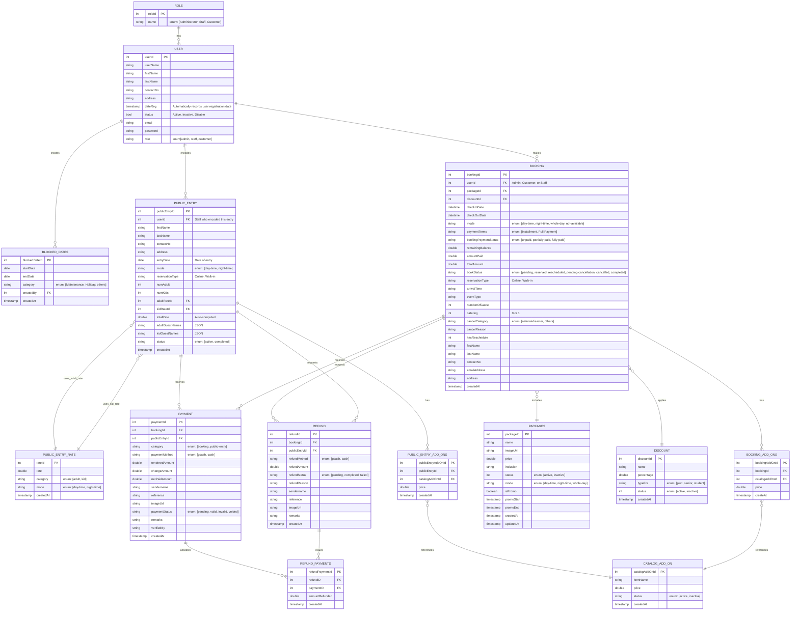

```mermaid
erDiagram

    ROLE {
        int roleId PK
        string name "enum: [Administrator, Staff, Customer]"
    }

    USER {
        int userId PK
        string userName
        string firstName
        string lastName
        string contactNo
        string address
        timestamp dateReg "Automatically records user registration date"
        bool status "Active, Inactive, Disable"
        string email
        string password
        string role "enum[admin, staff, customer]"
    }

    BLOCKED_DATES {
        int blockedDateId PK
        date startDate
        date endDate
        string category "enum: [Maintenance, Holiday, others]"
        int createdBy FK
        timestamp createdAt
    }

    PUBLIC_ENTRY {
        int publicEntryId PK
        int userId FK "Staff who encoded this entry"
        string firstName
        string lastName
        string contactNo
        string address
        date entryDate "Date of entry"
        string mode "enum: [day-time, night-time]"
        string reservationType "Online, Walk-in"
        int numAdult
        int numKids
        int adultRateId FK
        int kidRateId FK
        double totalRate "Auto-computed"
        string adultGuestNames "JSON"
        string kidGuestNames "JSON"
        string status "enum: [active, completed]"
        timestamp createdAt
    }

    PUBLIC_ENTRY_RATE {
        int rateId PK
        double rate
        string category "enum: [adult, kid]"
        string mode "enum: [day-time, night-time]"
        timestamp createdAt
    }

    PUBLIC_ENTRY_ADD_ONS {
        int publicEntryAddOnId PK
        int publicEntryId FK
        int catalogAddOnId FK
        double price
        timestamp createdAt
    }

    BOOKING {
        int bookingId PK
        int userId FK "Admin, Customer, or Staff"
        int packageId FK
        int discountId FK
        datetime checkInDate
        datetime checkOutDate
        string mode "enum: [day-time, night-time, whole-day, not-available]"
        string paymentTerms "enum: [Installment, Full Payment]"
        string bookingPaymentStatus "enum: [unpaid, partially-paid, fully-paid]"
        double remainingBalance
        double amountPaid
        double totalAmount
        string bookStatus "enum: [pending, reserved, rescheduled, pending-cancellation, cancelled, completed]"
        string reservationType "Online, Walk-in"
        string arrivalTime
        string eventType
        int numberOfGuest
        int catering "0 or 1"
        string cancelCategory "enum: [natural-disaster, others]"
        string cancelReason
        int hasReschedule
        string firstName
        string lastName
        string contactNo
        string emailAddress
        string address
        timestamp createdAt
    }

    PAYMENT {
        int paymentId PK
        int bookingId FK
        int publicEntryId FK
        string category "enum: [booking, public-entry]"
        string paymentMethod "enum: [gcash, cash]"
        double tenderedAmount
        double changeAmount
        double netPaidAmount
        string sendername
        string reference
        string imageUrl
        string paymentStatus "enum: [pending, valid, invalid, voided]"
        string remarks
        string verifiedBy
        timestamp createdAt
    }

    REFUND {
        int refundId PK
        int bookingId FK
        int publicEntryId FK
        string refundMethod "enum: [gcash, cash]"
        double refundAmount
        string refundStatus "enum: [pending, completed, failed]"
        string refundReason
        string sendername
        string reference
        string imageUrl
        string remarks
        timestamp createdAt
    }

    REFUND_PAYMENTS {
        int refundPaymentId PK
        int refundID FK
        int paymentID FK
        double amountRefunded
        timestamp createdAt
    }

    PACKAGES {
        int packageId PK
        string name
        string imageUrl
        double price
        string inclusion
        int status "enum: [active, inactive]"
        string mode "enum: [day-time, night-time, whole-day]"
        boolean isPromo
        timestamp promoStart
        timestamp promoEnd
        timestamp createdAt
        timestamp updatedAt
    }

    DISCOUNT {
        int discountId PK
        string name
        double percentage
        string typeFor "enum: [pwd, senior, student]"
        int status "enum: [active, inactive]"
        timestamp createdAt
    }

    BOOKING_ADD_ONS {
        int bookingAddOnId PK
        int bookingId FK
        int catalogAddOnId FK
        double price
        timestamp createAt
    }

    CATALOG_ADD_ON {
        int catalogAddOnId PK
        string itemName
        double price
        string status "enum: [active, inactive]"
        timestamp createdAt
    }

    %% Fixed relationships

    ROLE ||--o{ USER : has
    USER ||--o{ BOOKING : makes
    USER ||--o{ BLOCKED_DATES : creates
    USER ||--o{ PUBLIC_ENTRY : encodes

    PUBLIC_ENTRY ||--o{ PUBLIC_ENTRY_ADD_ONS : has
    PUBLIC_ENTRY_ADD_ONS }o--|| CATALOG_ADD_ON : references

    PUBLIC_ENTRY }o--|| PUBLIC_ENTRY_RATE : uses_adult_rate
    PUBLIC_ENTRY }o--|| PUBLIC_ENTRY_RATE : uses_kid_rate
    PUBLIC_ENTRY ||--o{ PAYMENT : receives
    BOOKING ||--o{ PAYMENT : receives
    PAYMENT ||--o{ REFUND_PAYMENTS : allocates
    REFUND ||--o{ REFUND_PAYMENTS : issues
    BOOKING ||--o{ REFUND : requests
    PUBLIC_ENTRY ||--o{ REFUND : requests

    BOOKING }o--|| PACKAGES : includes
    BOOKING }o--|| DISCOUNT : applies
    BOOKING ||--o{ BOOKING_ADD_ONS : has
    BOOKING_ADD_ONS }o--|| CATALOG_ADD_ON : references

```
