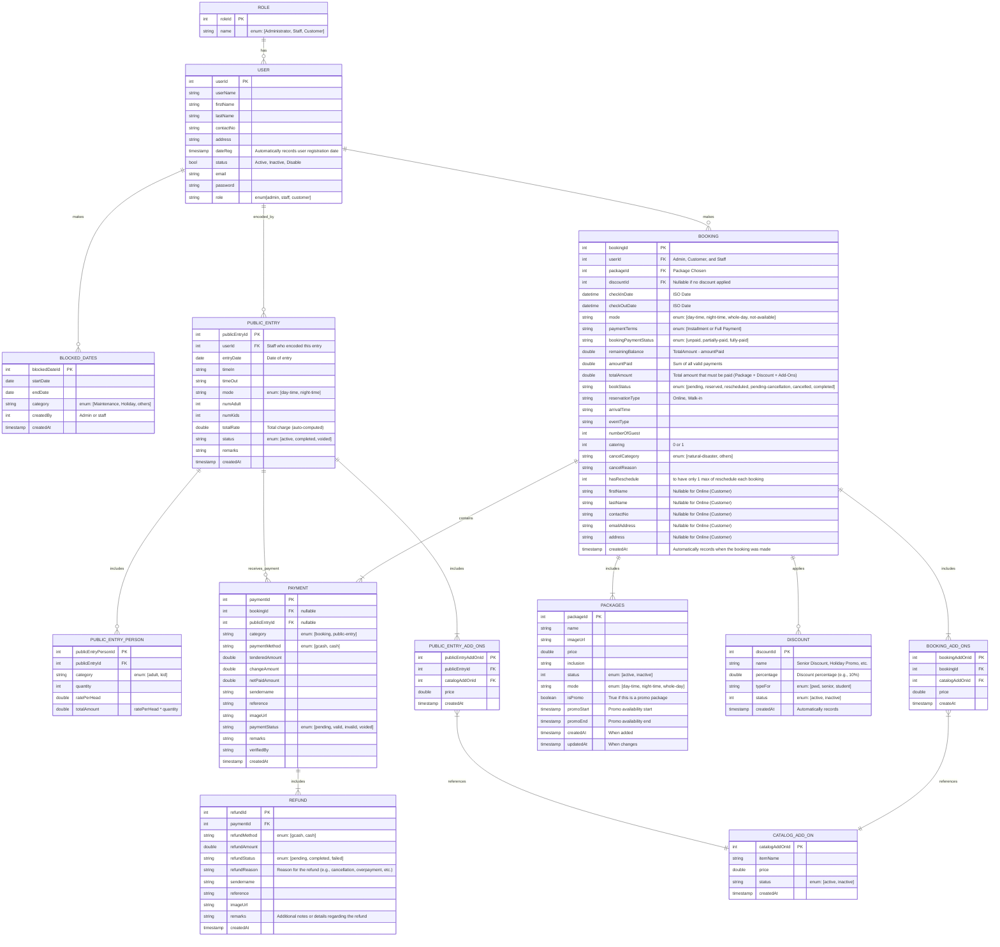

```mermaid
erDiagram

    ROLE {
        int roleId PK
        string name "enum: [Administrator, Staff, Customer]"
    }
    USER {
        int userId PK
        string userName
        string firstName
        string lastName
        string contactNo
        string address
        timestamp dateReg "Automatically records user registration date"
        bool status "Active, Inactive, Disable"
        string email
        string password
        string role "enum[admin, staff, customer]"
    }

    BLOCKED_DATES {
        int blockedDateId PK
        date startDate
        date endDate
        string category "enum: [Maintenance, Holiday, others]"
        int createdBy "Admin or staff"
        timestamp createdAt
    }

    PUBLIC_ENTRY {
        int publicEntryId PK
        int userId FK "Staff who encoded this entry"
        date entryDate "Date of entry"
        string timeIn
        string timeOut
        string mode "enum: [day-time, night-time]"
        int numAdult
        int numKids
        double totalRate "Total charge (auto-computed)"
        string status "enum: [active, completed, voided]"
        string remarks
        timestamp createdAt
    }

    PUBLIC_ENTRY_PERSON {
        int publicEntryPersonId PK
        int publicEntryId FK
        string category "enum: [adult, kid]"
        int quantity
        double ratePerHead
        double totalAmount "ratePerHead * quantity"
    }

    PUBLIC_ENTRY_ADD_ONS {
        int publicEntryAddOnId PK
        int publicEntryId FK
        int catalogAddOnId FK
        double price
        timestamp createdAt
    }

    BOOKING {
        int bookingId PK
        int userId FK "Admin, Customer, and Staff"
        int packageId FK "Package Chosen"
        int discountId FK "Nullable if no discount applied"
        datetime checkInDate "ISO Date"
        datetime checkOutDate "ISO Date"
        string mode "enum: [day-time, night-time, whole-day, not-available]"
        string paymentTerms "enum: [Installment or Full Payment]"
        string bookingPaymentStatus "enum: [unpaid, partially-paid, fully-paid]"
        double remainingBalance "TotalAmount - amountPaid"
        double amountPaid "Sum of all valid payments"
        double totalAmount "Total amount that must be paid (Package + Discount + Add-Ons)"
        string bookStatus "enum: [pending, reserved, rescheduled, pending-cancellation, cancelled, completed]"
        string reservationType "Online, Walk-in"
        string arrivalTime
        string eventType
        int numberOfGuest
        int catering "0 or 1"
        string cancelCategory "enum: [natural-disaster, others]"
        string cancelReason
        int hasReschedule "to have only 1 max of reschedule each booking"
        string firstName "Nullable for Online (Customer)"
        string lastName "Nullable for Online (Customer)"
        string contactNo "Nullable for Online (Customer)"
        string emailAddress "Nullable for Online (Customer)"
        string address "Nullable for Online (Customer)"
        timestamp createdAt "Automatically records when the booking was made"
    }

    PAYMENT {
        int paymentId PK
        int bookingId FK "nullable"
        int publicEntryId FK "nullable"
        string category "enum: [booking, public-entry]"
        string paymentMethod "enum: [gcash, cash]"
        double tenderedAmount
        double changeAmount
        double netPaidAmount
        string sendername
        string reference
        string imageUrl
        string paymentStatus "enum: [pending, valid, invalid, voided]"
        string remarks
        string verifiedBy
        timestamp createdAt
    }

    REFUND {
        int refundId PK
        int paymentId FK
        string refundMethod "enum: [gcash, cash]"
        double refundAmount
        string refundStatus "enum: [pending, completed, failed]"
        string refundReason "Reason for the refund (e.g., cancellation, overpayment, etc.)"
        string sendername
        string reference
        string imageUrl
        string remarks "Additional notes or details regarding the refund"
        timestamp createdAt
    }

    PACKAGES {
        int packageId PK
        string name
        string imageUrl
        double price
        string inclusion
        int status "enum: [active, inactive]"
        string mode "enum: [day-time, night-time, whole-day]"
        boolean isPromo "True if this is a promo package"
        timestamp promoStart "Promo availability start"
        timestamp promoEnd "Promo availability end"
        timestamp createdAt "When added"
        timestamp updatedAt "When changes"
    }

    DISCOUNT {
        int discountId PK
        string name "Senior Discount, Holiday Promo, etc."
        double percentage "Discount percentage (e.g., 10%)"
        string typeFor "enum: [pwd, senior, student]"
        int status "enum: [active, inactive]"
        timestamp createdAt "Automatically records"
    }

    BOOKING_ADD_ONS {
        int bookingAddOnId PK
        int bookingId FK
        int catalogAddOnId FK
        double price
        timestamp createAt
    }

    CATALOG_ADD_ON {
        int catalogAddOnId PK
        string itemName
        double price
        string status "enum: [active, inactive]"
        timestamp createdAt
    }


    ROLE ||--o{ USER : has
    USER ||--o{ BOOKING : makes
    USER ||--o{ BLOCKED_DATES : makes
    USER ||--o{ PUBLIC_ENTRY : encoded_by

    PUBLIC_ENTRY ||--o{ PUBLIC_ENTRY_PERSON : includes
    PUBLIC_ENTRY ||--|{ PUBLIC_ENTRY_ADD_ONS : includes
    PUBLIC_ENTRY_ADD_ONS }|--|| CATALOG_ADD_ON : references
    PUBLIC_ENTRY ||--o{ PAYMENT : receives_payment

    BOOKING ||--|{ PACKAGES : includes
    BOOKING ||--|{ PAYMENT : contains
    PAYMENT ||--|{ REFUND : includes
    BOOKING ||--o{ DISCOUNT : applies
    BOOKING ||--|{ BOOKING_ADD_ONS : includes
    BOOKING_ADD_ONS }|--|| CATALOG_ADD_ON : references


```
