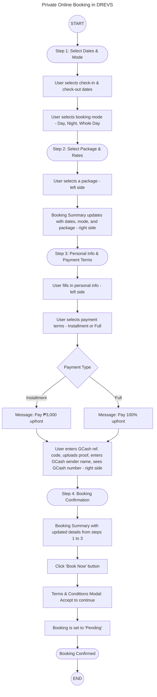

```mermaid
---
title: Private Online Booking in DREVS
---
flowchart TD
    A((START)) -->
    A1([Step 1: Select Dates & Mode]) --> A2[User selects check-in & check-out dates]
    A2 --> A3[User selects booking mode - Day, Night, Whole Day]
    A3 --> B1([Step 2: Select Package & Rates])
    
    B1 --> B2[User selects a package - left side]
    B2 --> B3[Booking Summary updates with dates, mode, and package - right side]
    B3 --> C1([Step 3: Personal Info & Payment Terms])

    C1 --> C2[User fills in personal info - left side]
    C2 --> C3[User selects payment terms - Installment or Full]
    
    C3 --> C4{Payment Type}
    C4 -- Installment --> C5[Message: Pay ₱3,000 upfront]
    C4 -- Full --> C6[Message: Pay 100% upfront]
    
    C5 --> C7
    C6 --> C7
    
    C7[User enters GCash ref. code, uploads proof, enters GCash sender name, sees GCash number - right side] --> D1([Step 4: Booking Confirmation])

    D1 --> D2[Booking Summary with updated details from steps 1 to 3]
    D2 --> D3[Click 'Book Now' button]
    D3 --> D4[Terms & Conditions Modal: Accept to continue]
    D4 --> D5[Booking is set to 'Pending']

    D5 --> END([Booking Confirmed]) -->
    E((END))
```
