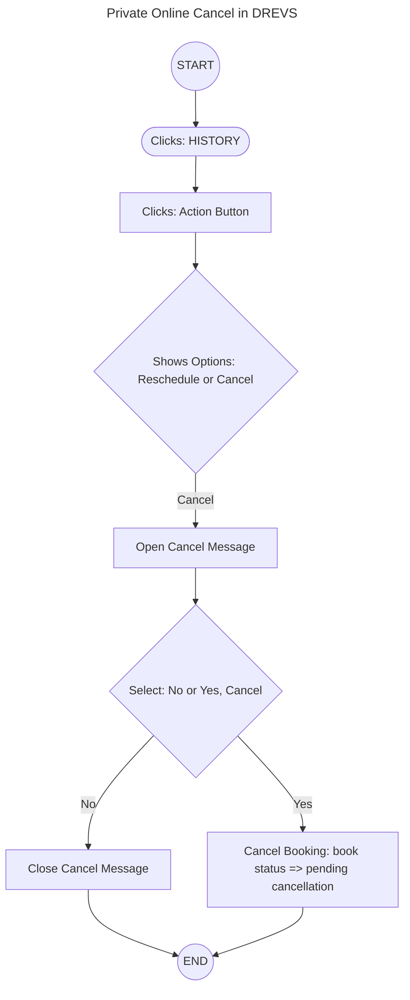

```mermaid
---
title: Private Online Cancel in DREVS
---
flowchart TD
    A((START)) --> A1([Clicks: HISTORY])
    A1 --> A2[Clicks: Action Button]
    A2 --> A3{Shows Options: Reschedule or Cancel}
    A3 -- Cancel --> A4[Open Cancel Message]
    A4 --> A5{Select: No or Yes, Cancel}
    A5 -- No --> A6[Close Cancel Message]
    A5 -- Yes --> A7[Cancel Booking: book status => pending cancellation]
    A6 --> E
    A7 --> E((END))

```
