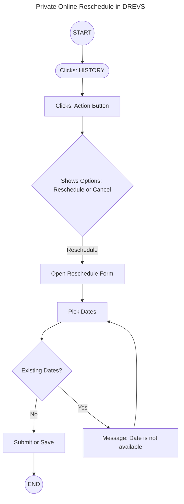

```mermaid
---
title: Private Online Reschedule in DREVS
---
flowchart TD
    A((START)) --> A1([Clicks: HISTORY])
    A1 --> A2[Clicks: Action Button]
    A2 --> A3{Shows Options: Reschedule or Cancel}
    A3 -- Reschedule --> A4[Open Reschedule Form]
    A4 --> A5[Pick Dates]
    A5 --> A6{Existing Dates?}
    A6 -- No --> A7[Submit or Save]
    A6 -- Yes --> A8[Message: Date is not available]
    A8 --> A5
    A7 --> E((END))

```
