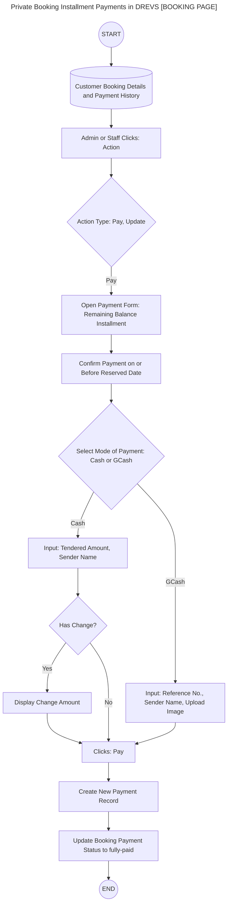

```mermaid
---
title: Private Booking Installment Payments in DREVS [BOOKING PAGE]
---
flowchart TD
    A((START)) --> A1[(Customer Booking Details and Payment History)]
    A1 --> B1[Admin or Staff Clicks: Action]
    B1 --> B2{Action Type: Pay, Update}
    B2 -- Pay --> B3[Open Payment Form: Remaining Balance Installment]

    B3 --> B4[Confirm Payment on or Before Reserved Date]
    B4 --> B5{Select Mode of Payment: Cash or GCash}

    B5 -- Cash --> B6[Input: Tendered Amount, Sender Name]
    B5 -- GCash --> B7[Input: Reference No., Sender Name, Upload Image]

    B6 --> B8{Has Change?}
    B8 -- Yes --> B10[Display Change Amount]
    B10 --> B9[Clicks: Pay]
    B8 -- No --> B9[Clicks: Pay]

    B7 --> B9

    B9 --> C1[Create New Payment Record]
    C1 --> C2[Update Booking Payment Status to fully-paid]
    C2 --> Z((END))

```
