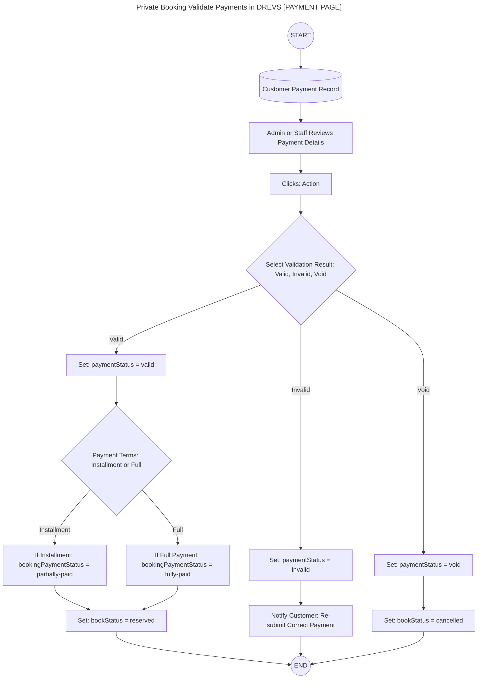

```mermaid
---
title: Private Booking Validate Payments in DREVS [PAYMENT PAGE]
---
flowchart TD
    A((START)) --> A1[(Customer Payment Record)]
    A1 --> A0[Admin or Staff Reviews Payment Details]
    A0 --> A2[Clicks: Action]
    A2 --> A3{Select Validation Result: Valid, Invalid, Void}

    A3 -- Valid --> A4[Set: paymentStatus = valid]
    A4 --> D1{Payment Terms: Installment or Full}
    D1 -- Installment --> A5[If Installment: bookingPaymentStatus = partially-paid]
    A5 --> A7
    D1 -- Full --> A6[If Full Payment: bookingPaymentStatus = fully-paid]
    A6 --> A7[Set: bookStatus = reserved]


    A3 -- Invalid --> B1[Set: paymentStatus = invalid]
    B1 --> B2[Notify Customer: Re-submit Correct Payment]

    A3 -- Void --> C1[Set: paymentStatus = void]
    C1 --> C2[Set: bookStatus = cancelled]

    A7 --> Z((END))
    B2 --> Z
    C2 --> Z

```
