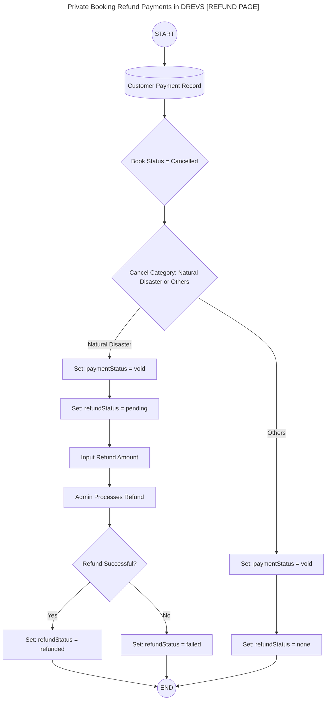

```mermaid

---
title: Private Booking Refund Payments in DREVS [REFUND PAGE]
---
flowchart TD
    A((START)) --> A1[(Customer Payment Record)]
    A1 --> A2{Book Status = Cancelled}

    A2 --> A3{Cancel Category: Natural Disaster or Others}

    A3 -- Natural Disaster --> B1[Set: paymentStatus = void]
    B1 --> B2[Set: refundStatus = pending]
    B2 --> B3[Input Refund Amount]
    B3 --> B4[Admin Processes Refund]
    B4 --> B5{Refund Successful?}

    B5 -- Yes --> B6[Set: refundStatus = refunded]
    B5 -- No --> B7[Set: refundStatus = failed]
    B6 --> Z((END))
    B7 --> Z

    A3 -- Others --> C1[Set: paymentStatus = void]
    C1 --> C2[Set: refundStatus = none]
    C2 --> Z

```
