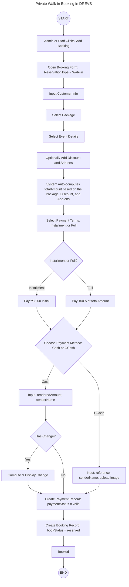

```mermaid
---
title: Private Walk-in Booking in DREVS
---
flowchart TD
    A((START)) --> B1[Admin or Staff Clicks: Add Booking]
    B1 --> B2[Open Booking Form: ReservationType = Walk-in]

    B2 --> C1[Input Customer Info]
    C1 --> C2[Select Package]
    C2 --> C3[Select Event Details]
    C3 --> C4[Optionally Add Discount and Add-ons]

    C4 --> D1[System Auto-computes totalAmount based on the Package, Discount, and Add-ons]
    D1 --> D2[Select Payment Terms: Installment or Full]

    D2 --> D3{Installment or Full?}
    D3 -- Installment --> E1[Pay ₱3,000 Initial]
    D3 -- Full --> E2[Pay 100% of totalAmount]

    E1 --> F1{Choose Payment Method: Cash or GCash}
    E2 --> F1

    F1 -- Cash --> G1[Input: tenderedAmount, senderName]
    G1 --> G3{Has Change?}
    G3 -- Yes --> G5[Compute & Display Change]
    G5 --> H1
    G3 -- No --> H1

    F1 -- GCash --> G2[Input: reference, senderName, upload image]
    G2 --> H1

    H1[Create Payment Record: paymentStatus = valid]
    H1 --> I1[Create Booking Record: bookStatus = reserved]
    I1 --> I2[Booked]
    I2 --> Z((END))

```
