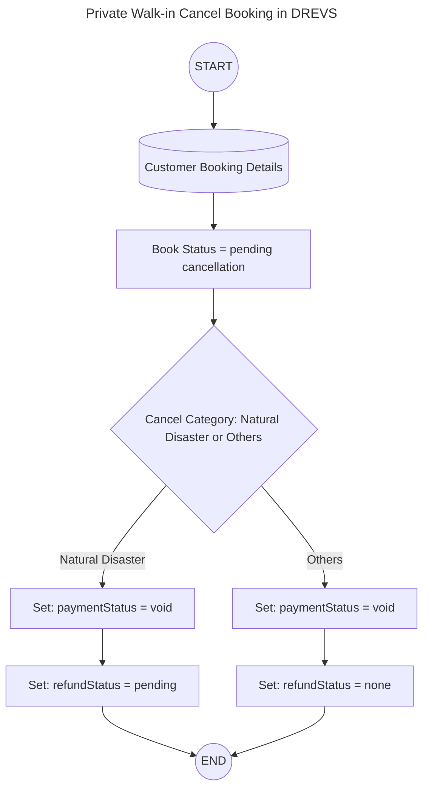

```mermaid
---
title: Private Walk-in Cancel Booking in DREVS
---
flowchart TD
    A((START)) --> A1[(Customer Booking Details)]
    A1 --> A2[Book Status = pending cancellation]

    A2 --> A3{Cancel Category: Natural Disaster or Others}
    A3 -- Natural Disaster --> B1[Set: paymentStatus = void]
    B1 --> B2[Set: refundStatus = pending]

    A3 -- Others --> C1[Set: paymentStatus = void]
    C1 --> C2[Set: refundStatus = none]

    B2 --> Z((END))
    C2 --> Z
```
