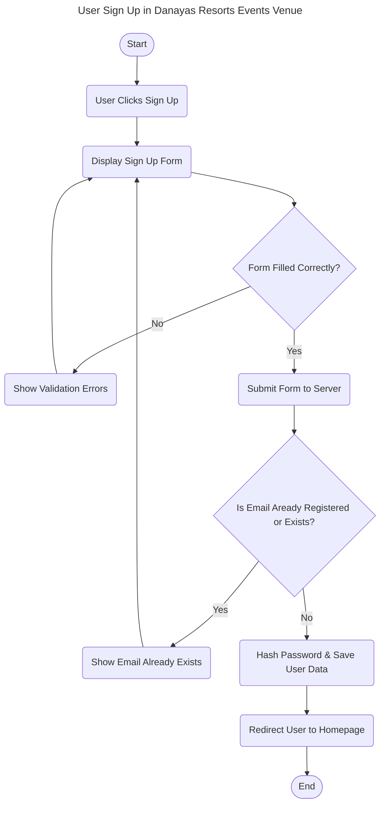

```mermaid
---
title: User Sign Up in Danayas Resorts Events Venue
---
flowchart TD
    START([Start]) -->
    CLICKS(User Clicks Sign Up) -->
    DISPLAY(Display Sign Up Form) -->
    FILLED{Form Filled Correctly?} -- No -->
    NO(Show Validation Errors) --> DISPLAY
    FILLED -- Yes --> 
    SUBMIT(Submit Form to Server) -->
    EXISTING{Is Email Aready Registered or Exists?} -- Yes -->
    EXIST(Show Email Already Exists) --> DISPLAY
    EXISTING -- No -->
    HASH(Hash Password & Save User Data) -->
    REDIRECT(Redirect User to Homepage) -->
    END([End])


                                  


```
