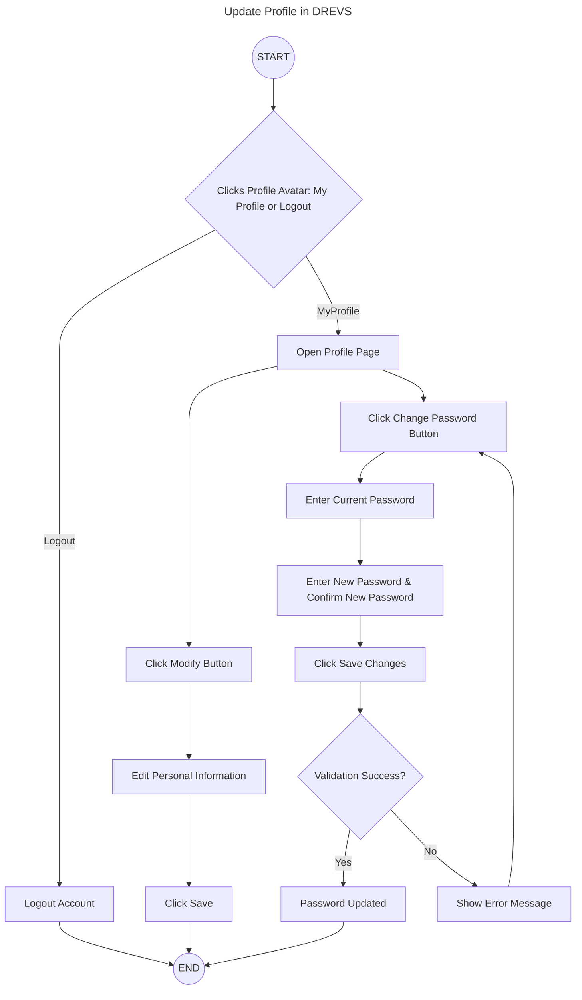

```mermaid
---
title: Update Profile in DREVS
---
flowchart TD
    A((START)) --> A1{Clicks Profile Avatar: My Profile or Logout}
    A1 -- Logout --> A2[Logout Account]
    A1 -- MyProfile --> A3[Open Profile Page]

    A3 --> A4[Click Modify Button]
    A4 --> A5[Edit Personal Information]
    A5 --> A6[Click Save]

    A3 --> B1[Click Change Password Button]
    B1 --> B2[Enter Current Password]
    B2 --> B3[Enter New Password & Confirm New Password]
    B3 --> B4[Click Save Changes]
    B4 --> B5{Validation Success?}
    B5 -- Yes --> B6[Password Updated]
    B5 -- No --> B7[Show Error Message]

    B6 --> E((END))
    B7 --> B1
    A2 --> E
    A6 --> E


```
